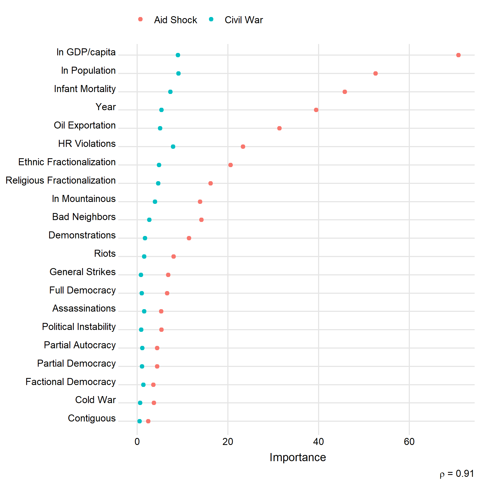
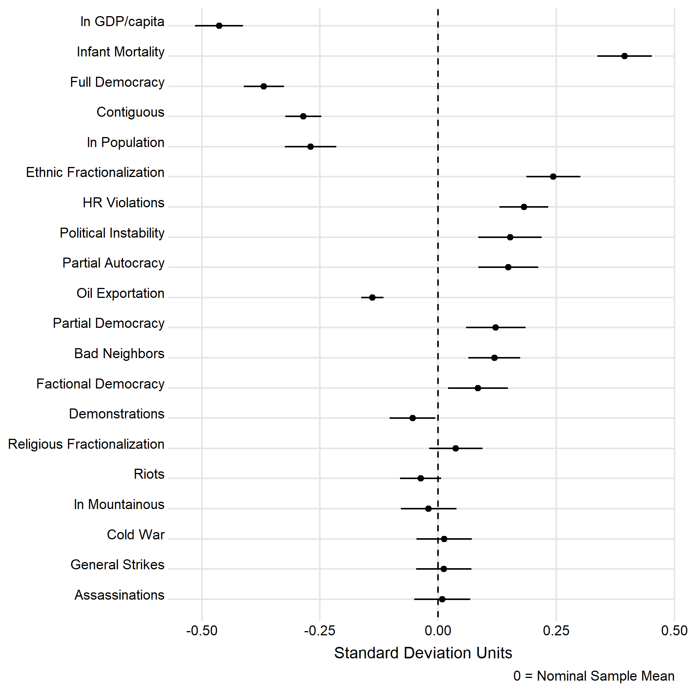

# Introduction

Covariate adjustment remains a perennial concern in observational studies. Most existing approaches impose necessary but potentially fragile parametric assumptions, while many robust non-parametric alternatives can be difficult to interpret. I propose a simple to implement method called random forest adjustment (RFA) that blends the interpretability of parametric estimators with the power and flexibility of non-parametric approaches.

As its name suggests, RFA applies the powerful and popular random forests machine learner to the problem of covariate adjustment. Random forest regression is a technique that is well known for its predictive power and ability to handle many forms of nonlinearity and covariate interactions in data. These are ideal qualities in any setting but especially so when adjusting for covariates when neither theory nor past research provide adequate guidance about an appropriate functional form. 

RFA consists of a two-step process. In the first stage, random forest regressions are fit to a response variable and a causal variable of interest using relevant covariates in the data. Predictions from these models are then used to re-center the outcome and causal variable so that only residual variation in each not explained by covariates remains. In the second stage, the residualized response is regressed on the residualized causal variable, and estimation is done via OLS. 

Simulations show that this approach is unbiased and efficient in the face of both linear and nonlinear forms of confounding. While a correctly specified parametric model performs slightly better, an incorrectly specified parametric model performs poorly while RFA remains insensitive to different functional forms. 

Following simulation, I apply RFA to replication data from @nielsenEtAl2011. The authors examined the effect of sudden and sizable negative shocks in the foreign aid received by developing countries as a share of GDP on the likelihood of civil war onset. This is an ideal dataset to illustrate RFA given the over 20 covariates used as control variables in the original study. Such a large number of variables implies a high probability of violations of linearity and additivity in the controls. 

Various diagnostics for random forests are also demonstrated using this data to highlight the ease of demystifying RFA estimates. A common complaint about non-parametric machine learners like random forests is that they are "black boxes" that may make good predictions but lack interpretability. This raises natural questions about how to interpret RFA estimates. What comparisons in the data do estimates reflect? What does the effective sample used to generate these estimates look like after adjustment? 

Well established processes exist for answering these questions. Variable importance metrics can be used to identify which variables were most prognostic of the outcome and causal variable in the random forests. Further, using the method outlined by @aronowSamii2016 it is possible to draw comparisons between the nominal data sample and the effective data sample upon which estimates are based. Both methods lift the veil on RFA estimates, showing that random forests are more transparent than given credit.

Though RFA is not a one-size-fits-all solution for covariate adjustment, it has many desirable qualities that make it a powerful addition to any methodological toolbox. This novel application of random forests also provides a foundation for exploring other adjustment procedures that substitute random forests with gradient boosting methods, support vector machines, or even super learner approaches that use an ensemble of machine learners to generate predictions. There are many untried but promising extensions, and it is hoped this introduction to RFA spurs further innovations.


# Random Forest Regression

The past two decades witnessed the development and evolution of numerous machine learning techniques for causal inference. Among these methods, random forest regression has gained special popularity. Since its development by @brieman2001, random forest regression has been widely used across a range of industries and scientific fields, due in no small part to its high level of predictive performance and simultaneous resistance to overfitting [@wager2016].

It comes as little surprise, then, that random forests have found increasing use among political scientists. @hillJones2014, for instance, use random forests to test the predictive power of various political, economic, and social conditions on state repression. @bonica2018 uses the method to assess the predictive power of campaign contributions on roll call votes in the US Congress. Meanwhile, @carrollKenkel2019 use the approach, in addition to other machine learning algorithms, to generate a proxy for relative military power among states.

Beyond political science, social scientists across fields and disciplines have applied random forests in their research---e.g., @atheyImbens2015 and @fosterEtAl2011. These studies are joined by a broader literature that has developed creative applications of other machine learning techniques for causal inference.^[For more examples see @wager2016.]

Random forest regression is a powerful technique for a number of reasons. Random forests are an ensemble machine learner---so called because random forests are an ensemble of many individual regression trees. These individual trees, or base learners, are "grown" on either random subsamples, or bootstrapped samples, of a training dataset. For each sample, a random set of predictors is then selected. Among this set of predictors, a partition is made along one of these predictors such that the residual sum of squares between the predicted and observed value of the response is minimized (this is the first set of "branches" in the tree). Within these partitions, a new subset of variables is sampled, the best predictor of the response within this subset is identified, and a new optimal partition is made. This process continues until some criterion is reached. 

By repeating this process multiple times, a "forest" of these base tree learners is produced. The random forest prediction for an individual observation is then generated by a "voting" process, whereby the average of the regression tree predictions for a given observation is used to generate an overall forest prediction.\footnote{This process is slightly modified when the response is a discrete category. Random forests can be used both for categorization and regression---in the latter case, the base learners are optimized to predict the conditional mean of the response.}

The combination of using regression trees as base learners, bootstrapping samples and subsampling predictors, and bagging predictions makes random forest regression robust to various forms of nonlinearity and variable interactions. At the same time, these features confer resistance to overfitting and the influence of outlier observations. These features, by extension, should make random forests a powerful ally in adjusting for the confounding influence of covariates in observational data.


# Applying Random Forests within a Covariate Adjustment Framework

Consider the simple linear regression model, with a real valued response $Y_i$ and a real valued predictor (or causal variable) $X_i$, where $i = 1, ..., n$:
$$Y_i = \alpha + \beta X_i + \epsilon_i. \tag{1}$$

The parameter $\beta$ denotes the unit change in $Y_i$ per a unit change in $X_i$, $\alpha$ is the expected value of $Y_i$ when $X_i = 0$, and $\epsilon_i$ is unexplained noise. Since $\alpha$ is not of primary importance, we may de-mean both $Y_i$ and $X_i$ and fix $\alpha = 0$ without doing violence to the estimation of $\beta$. This gives the modified specification:
$$Y_i - \overline{Y} = \beta \left(X_i - \overline{X} \right) + \epsilon_i. \tag{2}$$

Many estimators exist for recovering $\beta$, but the most common solution is ordinary least squares (OLS). This entails finding $\hat{\beta} \in \mathbb{R}$ that minimizes the residual sum of squares:
$$\text{rss} = \sum_{i = 1}^n \left[\left(Y_i - \overline{Y} \right) - \hat{\beta} \left(X_i - \overline{X} \right) \right]^2. \tag{3}$$
This has the closed-form solution:
$$\hat{\beta} = \frac{\text{cov}\left(X_i, Y_i \right)}{\text{var}\left( X_i \right)} = \frac{\sum_{i = 1}^n \left(X_i - \overline{X} \right)\left( Y_i - \overline{Y} \right)}{\sum_{i = 1}^n \left( X_i - \overline{X}\right)^2}. \tag{4}$$
The residual values $\hat{\epsilon}_i$ are of course calculated as $\hat{\epsilon}_i = \left(Y_i - \overline{Y} \right) - \hat{\beta} \left(X_i - \overline{X} \right)$.

A prominent feature of equations 2-4 is that the sample means of $Y_i$ and $X_i$ act as pivot points that, once fixed, provide the appropriate variation in $Y_i$ and $X_i$ necessary for estimating $\hat{\beta}$. In a simple regression model with only one predictor, these pivot points are held constant. However, when additional covariates are controlled for in a regression model, these means are conditional. Suppose we extend the regression model by including a second predictor $Z_i$:
$$Y_i = \alpha + \beta X_i + \delta Z_i + \epsilon_i. \tag{5}$$
The least squares solution for $\beta$ now takes into account the *conditional* means of $Y_i$ and $X_i$ given $Z_i$ in fixing the pivot points for each variable. Let $\hat{Y}_i^z$ equal the conditional mean of $Y_i$ given $Z_i$, and let $\hat{X}_i^z$ equal the conditional mean of $X_i$ given $Z_i$. The solution for $\hat\beta$ now is:
$$\hat{\beta} = \frac{\text{cov}\left(X_i - \hat{X}_i^z, Y_i - \hat{Y}_i^z \right)}{\text{var}\left( X_i - \hat{X}_i^z \right)} = \frac{\sum_{i = 1}^n \left(X_i - \hat{X}_i^z \right)\left( Y_i - \hat{Y}_i^z \right)}{\sum_{i = 1}^n \left( X_i - \hat{X}_i^z\right)^2}. \tag{6}$$

Within the multiple regression framework, the pivot values for $Y_i$ and $X_i$ are identified as linear functions of $Z_i$:
$$
Y_i = \eta + \eta_z Z_i + \upsilon_i; \quad X_i = \gamma + \gamma_z Z_i + \mu_i. \tag{7}
$$
Essentially, this means that the solution for $\hat\beta$ is equivalently identified by regressing the residual variation in $Y_i$ on the residual variation in $X_i$ from the above linear models:
$$
\hat{\upsilon}_i = \beta \hat{\mu}_i + \epsilon_i \quad \text{s.t.} \quad  \hat{\beta} = \frac{\sum_{i = 1}^n \hat{\mu}_i \hat{\upsilon}_i}{\sum_{i=1}^n \hat{\mu}_i^2}. \tag{8}
$$

A limitation of this approach, and the one that motivates this note, is that this method of covariate adjustment is valid only to the extent that $Y_i$ and $X_i$ can be adequately expressed as linear functions of $Z_i$. Any violations in functional form impend bias in the solution for $\hat\beta$. Enter random forest adjustment.

Regression adjustment via random forests innovates on the above multiple regression framework by generalizing the process of identifying the appropriate conditional means (pivot points) of the response and the variable of interest given other observed covariates. For the above example where the relationship between $Y_i$ and $X_i$ accounts for $Z_i$, this entails replacing the linear model predictions for these variables given $Z_i$ with their random forest generated predictions given $Z_i$. 

To be more explicit, suppose we generalize the functional forms shown in 7:
$$
Y_i = f_y(Z_i) + \upsilon_i; \quad X_i = f_x(Z_i) + \mu_i. \tag{9}
$$
Let $\hat{f}_x(Z_i)$ denote the expected values of $X_i$ given $Z_i$, and let $\hat{f}_y(Z_i)$ denote the expected values of $Y_i$ given $Z_i$. Using these values as the new pivot points the solution for $\hat\beta$ now is:
$$\hat{\beta} = \frac{\text{cov}\left[X_i - \hat{f}_x(Z_i), \space Y_i - \hat{f}_y(Z_i) \right]}{\text{var}\left[X_i - \hat{f}_x(Z_i)\right]}. \tag{10}$$

In a multiple regression framework the $f(\cdot)$ functions can only ever be linear. In random forest adjustment, these functions may take any number of forms. In the event that a linear form best approximates the relationships in the data, multiple regression will do well. However, to the extent that the confounding influence of $Z_i$ deviates from the linear assumptions of a linear multiple regression model, the pivot points used to center the response and causal variable will be erroneous and $\hat\beta$ will reflect inappropriate comparisons in the data sample. But, as far as the data-driven approach of random forests is robust to such deviations, random forest adjustment will yield better pivot points and thus $\hat\beta$ will reflect more appropriate comparisons. 


# An Outline of RFA

RFA consists of a two-step process. In the first stage, random forest regressions are fit to a response variable and a causal variable of interest using relevant covariates in the data. Predictions from these models are then used to re-center the outcome and causal variable so that only residual variation in each not explained by covariates remains. In the second stage, the residualized response is regressed on the residualized causal variable, and estimation is done via OLS. 

Returning the the running example using $Y_i$, $X_i$, and $Z_i$ this process goes as follows:

\bigskip

  1. Train random forest models using $Z_i$ to predict both $Y_i$ and $Z_i$. Then, center $Y_i$ and $X_i$ on their random forest predicted values given $Z_i$: $\dot{Y}_i = Y_i - \hat{Y}_i^z$ and $\dot{X}_i = X_i - \hat{X}_i^z$.
  2. Regress the centered response on the centered explanatory variable: $\dot{Y}_i = \beta \dot{X}_i + \epsilon_i$. 
  
\bigskip

# Limitations

The proposed strength of random forest adjustment (RFA) is its robustness to functional form violations in the confounding influence of one or several covariates in a data sample. This is a real virtue, but before demonstrating its advantages some limitations bear noting.

While its atheoretical approach to regression adjustment confers a certain degree of robustness, this same atheoreticism may be also a point of concern. Random forests, while powerful, are criticized for their limited interpretability. By extension, this raises natural questions about how RFA estimates should be interpreted. If the method of controlling for covariates is a "black box," this implies obscurity about the comparisons in the data sample that RFA supports as well. However, there are numerous methods for lifting the lid on this black box that should mitigate this concern. Such methods will be discussed in greater detail in a subsequent section.

Another limitation of RFA is also simply a limitation of all observational studies: unknown or unmeasured sources of confounding. RFA estimates are only as good as the data used by a researcher. If an important confounding variable is missing, it should go without saying that the quality of RFA estimates cannot be guaranteed.

Finally, the RFA framework as described here is constructed to address situations where a researcher has an interest in estimating the association between *one* explanatory variable and an outcome. There of course may be situations where a scholar is interested in an interactive effect or more complex causal relationships. Modifying RFA to accommodate such studies is an important goal for future development.


# Monte Carlo Analysis

## The Simulation

To assess the performance of RFA in comparison to multiple regression adjustment (MRA), I perform a Monte Carlo analysis using two different data-generating processes. For the first, I simulate a simple linear d.g.p. For $n$ observations where $i = 1,...,n$, I specify:
$$
\begin{aligned}
Y_i & \sim \mathcal{N}\left(\mu_i = 1 + \beta X_i + 0.5 Z_i, \sigma = 10 \right), \\
X_i & \sim \mathcal{B}\left(n = 1, p = 1 / (1 + \exp\{ 2 - 0.05Z_i \}) \right), \\
Z_i & \sim \mathcal{N}\left(\mu_i = 50, \sigma = 10 \right).
\end{aligned}
$$
For three different possible $n$s ($n = 500; \space 1,000; \space 2,000$), I iteratively simulate the d.g.p. 10,000 times. For each iteration, I recover an estimate of $\beta$ using both MRA and RFA. For the sake of this exercise, the true value of $\beta = 5$.

I further simulate a nonlinear d.g.p., specified as
$$
\begin{aligned}
Y_i & \sim \mathcal{N}\left(\mu_i = 1 + \delta X_i + 0.5 Z_i + Z_i^2, \sigma = 10 \right), \\
X_i & \sim \mathcal{B}\left(n = 1, p = 1 / (1 + \exp\{ 2 - 0.05[1.15Z_i - \bar{Z} ]^2 \}) \right), \\
Z_i & \sim \mathcal{N}\left(\mu_i = 50, \sigma = 10 \right).
\end{aligned}
$$
As before, for $n$ of 500, 1,000, and 2,000 I iteratively simulate the d.g.p. 10,000 times and for each iteration I recover estimates of $\beta$ via MRA and RFA.

The use of a single confounder, $Z_i$, is certainly not representative of most real-world cases. However, by focusing on one confounder it is all the easier to bring into stark relief the very real implications of confounding and how even simple model mispecification (like failure to include a quadratic term) can produce inconsistent estimates on the causal variable of interest. It further aids in clear exposition of the robustness of RFA to such errors.

After running the simulations, I summarize the performance of each approach according to the average percent bias in parameter estimates, the percent coverage of 95$\%$ confidence intervals\footnote{Based on HC1 robust estimates of parameter variance.} the average size of the standard errors, and the root mean squared error (RMSE) of the parameter estimates. 


## Results

A summary of the performance of RFA and MRA is shown in Figure 1. For each metric used to assess the approaches, results are shown for the different samples sizes ($N = 500; \space 1,000; \space 2,000$), and for the linear (left) and nonlinear (right) cases. 

```{r, echo = FALSE, message=FALSE, warning=FALSE, fig.height=8, fig.width=4, fig.cap="Performance of RFA vs. MRA"}
load("figures/monte_carlo_results.R")
library(kableExtra)
library(tidyverse)
# kable(
#   g1$data %>% select(-.group) %>%
#     spread(key = confounding, value = value) %>%
#     rename(
#       Method = estimator,
#       Metric = metric
#     ) %>%
#     arrange(Metric, Method, N) %>%
#     mutate(N = prettyNum(N, big.mark = ",")),
#   "latex",
#   digits = 3,
#   booktabs = T,
#   caption = "Performance of RFA vs. MRA",
#   linesep = c("", "", "\\hline")
# ) %>% cat()
g1$data %>%
  ggplot() +
  aes(
    reorder(scales::comma(N), N),
    value,
    fill = estimator
  ) +
  facet_wrap(
    metric ~ confounding,
    scales = "free",
    ncol = 2
  ) +
  geom_col(
    position = "dodge"
  ) +
  labs(
    x = "Sample Size",
    y = NULL,
    fill = NULL
  ) +
  theme_bw() +
  theme(
    legend.position = "top"
  )
t <- g1$data %>%
  mutate(
    v = round(value, 2)
  )
v <- function(w, x, y, z) {
  (t %>%
     filter(
       estimator == w,
       confounding == x,
       metric == y,
       N == z
     ))$v %>%
    prettyNum(big.mark = ",")
}

```

Upon examination of the results, it is immediately apparent that RFA confers a substantial advantage with respect to the nonlinear d.g.p. The average percent bias of RFA estimates are `r v("RFA", "Nonlinear", "% Bias", 500)`, `r v("RFA", "Nonlinear", "% Bias", 1000)`, and `r v("RFA", "Nonlinear", "% Bias", 2000)` for $N$ of 500, 1,000, and 2,000 respectively. For MRA, the average percent bias is orders of magnitude worse: `r v("MRA", "Nonlinear", "% Bias", 500)`, `r v("MRA", "Nonlinear", "% Bias", 1000)`, and `r v("MRA", "Nonlinear", "% Bias", 2000)` for each successive $N$. With respect to coverage, for each sample size in ascending order, RFA 95$\%$ confidence intervals contain the true estimate `r v("RFA", "Nonlinear", "% Coverage", 500)`, `r v("RFA", "Nonlinear", "% Coverage", 1000)`, and `r v("RFA", "Nonlinear", "% Coverage", 2000)` percent of the time. For MRA, none contain the true effect.

RFA estimates from the nonlinear d.g.p. are also more efficient and less prone to error in general. The average standard error for RFA estimates for each sample size is `r v("RFA", "Nonlinear", "Mean S.E.", 500)`, `r v("RFA", "Nonlinear", "Mean S.E.", 1000)`, and `r v("RFA", "Nonlinear", "Mean S.E.", 2000)` in ascending order. Meanwhile, on average the standard errors of MRA estimates are several times wider: `r v("MRA", "Nonlinear", "Mean S.E.", 500)`, `r v("MRA", "Nonlinear", "Mean S.E.", 1000)`, and `r v("MRA", "Nonlinear", "Mean S.E.", 2000)` respectively. Further, RMSE for the RFA estimates for each sample size are `r v("RFA", "Nonlinear", "RMSE", 500)`, `r v("RFA", "Nonlinear", "RMSE", 1000)`, and `r v("RFA", "Nonlinear", "RMSE", 2000)`; while for MRA, RMSE is `r v("MRA", "Nonlinear", "RMSE", 500)`, `r v("MRA", "Nonlinear", "RMSE", 1000)`, and `r v("MRA", "Nonlinear", "RMSE", 2000)`.

While RFA performs better in terms of both bias and efficiency when dealing with a nonlinear d.g.p., as the results to the left show, MRA is moderately less biased and prone to slightly less error if the d.g.p. is linear. The average percent bias of RFA estimates are `r v("RFA", "Linear", "% Bias", 500)`, `r v("RFA", "Linear", "% Bias", 1000)`, and `r v("RFA", "Linear", "% Bias", 2000)` for $N$ of 500, 1,000, and 2,000 respectively. For MRA, the average percent bias is moderately improved: `r v("MRA", "Linear", "% Bias", 500)`, `r v("MRA", "Linear", "% Bias", 1000)`, and `r v("MRA", "Linear", "% Bias", 2000)` for each $N$. With respect to coverage, for each sample size in ascending order, RFA 95$\%$ confidence intervals contain the true estimate `r v("RFA", "Linear", "% Coverage", 500)`, `r v("RFA", "Linear", "% Coverage", 1000)`, and `r v("RFA", "Linear", "% Coverage", 2000)` percent of the time. For MRA, they contain the true estimate `r v("MRA", "Linear", "% Coverage", 500)`, `r v("MRA", "Linear", "% Coverage", 1000)`, and `r v("MRA", "Linear", "% Coverage", 2000)` of the time.

Further, RFA estimates, while no more or less efficient than MRA estimates, tend to be slightly more prone to error. The average standard error for RFA estimates for each sample size is `r v("RFA", "Linear", "Mean S.E.", 500)`, `r v("RFA", "Linear", "Mean S.E.", 1000)`, and `r v("RFA", "Linear", "Mean S.E.", 2000)` in ascending order. Meanwhile, on average the standard errors of MRA estimates nearly identical: `r v("MRA", "Linear", "Mean S.E.", 500)`, `r v("MRA", "Linear", "Mean S.E.", 1000)`, and `r v("MRA", "Linear", "Mean S.E.", 2000)` respectively. However, RMSE for the RFA estimates for each sample size are `r v("RFA", "Linear", "RMSE", 500)`, `r v("RFA", "Linear", "RMSE", 1000)`, and `r v("RFA", "Linear", "RMSE", 2000)`; while for MRA, RMSE is `r v("MRA", "Linear", "RMSE", 500)`, `r v("MRA", "Linear", "RMSE", 1000)`, and `r v("MRA", "Linear", "RMSE", 2000)`.

The finding that RFA is slightly more prone to error and bias when the true d.g.p. is linear makes a good deal of sense. The nonparametric approach of random forests, though powerful and capable of detecting a wide array of relationships, is just not as efficient as a parametric linear regression model when dealing with a linear d.g.p. It is nonetheless encouraging that RFA does not perform *much* worse than parametric regression adjustment when dealing with linear confounding. Further, as suggested by the variation in each estimator's performance with increasing sample sizes, RFA's error converges to that of MRA given a sufficient number of observations. However, while RFA performs only moderately worse than MRA in the face of a linear d.g.p., it is far and away superior when dealing with nonlinear confounding in the data. 

The reason for this result is simple. A correctly specified parametric regression model is generally more efficient than the nonparametric approach taken by random forests, especially when dealing with finite samples. However, random forests is generally a robust method of approximating the form of confounding in the data absent an appropriately specified parametric model, and its performance in this task improves with the sample size.


# Random Forest Adjustment, Aid Shocks, and Civil War

To demonstrate how RFA might be used with real-world data, I apply it to replication data made publicly available by @nielsenEtAl2011. In their study, the authors assess the impact of negative aid shocks on the likelihood of civil war onset in developing countries that regularly receive foreign aid from industrialized donor countries. Theirs is an ideal dataset to use due to the potential for myriad violations of linearity and additivity in the confounding influence of covariates. In their study, @nielsenEtAl2011 control for some 20 variables in estimating the effect of aid shocks---providing ample opportunity for unanticipated forms of confounding.

This dataset is also useful for demonstrating how various diagnostics can be applied to demystify random forest adjusted estimates. Using variable importance metrics for random forests, it is possible to uncover which of the numerous covariates is the greatest source of confounding in the data. Further, using the method outlined by @aronowSamii2016, it is possible to assess how the effective sample produced via random forest adjustment compares to the nominal sample used at the outset.


## Background: Aid Shocks and Civil War

Before diving into the analysis, it first will be helpful to summarize Nielsen et al.'s [-@nielsenEtAl2011] motivation for assessing the link between aid shocks and civil war. The authors note the underexamined role of aid instability in the onset of intra-state conflict. They posit that sudden changes in aid received by developing country governments can upset the balance of power between rebels and the state. Many countries rely on aid flows for a sizable share of their total outlays, and thus their budgets are subject to substantial windfalls or shortfalls as a consequence of fluctuations in total aid received. In their own words, the authors contend "that rapid changes in aid flows---aid shocks---can grow large enough to materially affect the balance of power between a government---the sovereign recipient of aid flows---and potential rebels, which we define as individuals or groups that might use violence to oppose the government" [@nielsenEtAl2011, 221]. 

Their contention is that sudden and sizable declines in aid flows can diminish a government's capacity to deter would-be rebels and to continue side-payments to rebels to keep them appeased. The sudden shift in power that ensues generates a commitment problem between rebels and the state. Reduced deterrence increases rebel's assessment of their likelihood of victory, thus leading insurgents to demand greater side-payments in exchange for peace. At the same time, the government faces a shortfall in funds due to the decline in aid flows, making it harder to afford the necessary side-payments to keep rebels at bay. 

The converse of negative aid shocks---positive aid shocks---according to the authors has more ambiguous implications. There are reasons to anticipate a sudden windfall in revenue would strengthen the government's position relative to insurgents, thus enhancing deterrence. However, the increase in resources might also invoke its own kind of commitment problem, namely, that rebels will demand larger side-payments. Given these competing logics, the authors leave the effect of positive aid shocks an open question.

To test whether aid shocks influence the probability of conflict the authors compiled a time-series, cross-sectional dataset of up to 139 aid recipient countries from 1981 to 2005. The outcome variable in the dataset is a binary indicator of armed conflict onset drawn from the UCDP/PRIO database [@gleditschEtAl2002]. The dataset codes a conflict as "1" ("0" otherwise) if at least 25 battle deaths occurred in a given year in a conflict between two or more actors, where at least one of the combatants was government forces. In their primary specification, subsequent years of civil war are dropped from the analysis, but any subsequent resumptions of conflict are kept.

The primary explanatory variable of interest is the incidence of an "aid shock," coded as "1" for the bottom 15$\%$ of observations in changes in aid flows per recipient GDP. Aid flows are measured as the total of Official Development Assistance (ODA) as grants and loans received by a developing country in a given year, as recorded in the AidData database [@tierneyEtAl2011]. The authors consider additional thresholds for aid shocks beyond being below the 15$^\text{th}$ percentile. A positive aid shock, conversely, is coded as "1" ("0" otherwise) for any changes in aid per GDP at or above the 85$^\text{th}$ percentile. To adjust for possible time delays in the effect of aid shocks, values are lagged by one year.

The authors adjust for a wide range of possible confounding covariates. These are listed in Table 1. Each of these has been used elsewhere in the civil war literature to predict armed conflict.

\begin{table}[!t] \centering
  \caption{List of Confounding Variables}
  \label{}
\begin{tabular}{@{\extracolsep{5pt}} l} 
\toprule
(1) Ethnic Fractionalization; (2) Religious Fractionalization; (3) Oil Exportation; \\
(4) Political Instability; (5) Population; (6) Territorial Contiguity; \\
(7) Mountainous Terrain; (8) Human Rights Violations; (9) Assassinations; \\
(10) General Strikes; (11) Riots; (12) Antigovernment Demonstrations; \\
(13) Infant Mortality; (14) Neighboring Countries Experiencing Civil or Ethnic Conflict; \\
(15) The Cold War; (16) Democracy (Goldstone et al. 2010); (17) GDP per capita. \\
\bottomrule
\end{tabular}
\end{table}

In their original analysis, the authors estimated a rare-events logit model [see @kingZeng2001] using the pooled country-year data, and used robust standard errors clustered by aid recipient country. After imputing missing values, and cutting subsequent years of conflict from the data, the final dataset consisted of 2,627 observations. The choice of rare-events logit was made given the relatively small number of occurrences of civil war onset in the data. As Table 2 summarizes, the sample contained only 93 instances of civil war onset---only 4$\%$ of observations. Since the focus here is on demonstrating an application of random forest adjustment, for the sake of space a replication of the authors' method will not be considered here.

\begin{table}[!t] \centering 
  \caption{Instances of Civil War Onset} 
  \label{} 
\begin{tabular}{@{\extracolsep{5pt}} cccc} 
\toprule
Civil War & N & Proportion \\ 
\midrule
No & 2,535 & 0.96 \\ 
Yes & 93 & 0.04 \\ 
\bottomrule
\end{tabular} 
\end{table} 


## Results

RFA estimates are shown in Table 3. Entries denote estimated coefficients, with robust standard errors, clustered by aid recipient, shown in parentheses. The first column denotes the effect of negative aid shocks, with the same 15$^\text{th}$ percentile cutoff used by @nielsenEtAl2011. Unlike the effect identified by the authors, the RFA estimate falls short of statistical significance. The same is true for the effect of a positive shock (defined according to the 85$^\text{th}$ percentile). 

To assess whether alternative percentile cutoffs yielded different results, the third and fourth columns of Table 3 show the effects of negative and positive aid shocks, defined in terms of the 25$\text{th}$ and 75$\text{th}$ percentiles respectively. Recovered RFA estimates for these versions of the variable are statistically significant. The first suggests that a negative aid shock increases the likelihood of civil war onset by 2.7 percentage points ($p < 0.05$), while the second suggests that a positive aid shock decreases the likelihood of civil war onset by $2.5$ percentage points ($p < 0.05$). 

\begin{table}[!t] \centering
\caption{Random Forest Adjusted Estimates}
\label{}
\begin{tabular}{l c c c c}
\toprule
 & Negative & Positive & Negative (25th) & Positive (75th) \\
\midrule
Shock      & $0.009$   & $-0.020$  & $0.027^{*}$ & $-0.025^{*}$ \\
           & $(0.014)$ & $(0.014)$ & $(0.012)$   & $(0.011)$    \\
\hline
Num. obs.  & 2,627    & 2,627    & 2,627      & 2,627       \\
N Clusters & $139$     & $139$     & $139$       & $139$        \\
\bottomrule
\multicolumn{5}{l}{\scriptsize{$^{***}p<0.001$; $^{**}p<0.01$; $^{*}p<0.05$}}
\end{tabular}
\end{table}

Figure 2 shows the range of alternative RFA estimates recovered by applying alternative percentile cutoffs for aid shocks. Unlike Nielsen et al. (2011) who find that only negative aid shocks, and only within a limited range of cutoffs, effect the likelihood of civil war, the results shown in Figure 1 suggest that aid shocks defined over a range of cut-points have a significant relationship with civil war onset after adjusting for covariates. 

```{r, echo=FALSE, fig.height=4, fig.width=8, fig.cap="The estimated effect of aid shocks on civil war onset."}
load("figures/aid_shock_effect.R")
civ_plot
```

These results suggest a monotonic relationship between changes in aid per GDP and civil war. To test the monotonicity of this relationship, I further applied RFA to assess the relationship between three continuous versions of the explanatory variable of interest and the response. Table 4 shows the results. In the first column, the raw values of change in aid per GDP are used. In the second, changes in aid per GDP are rank transformed---and further scaled to standard deviation units. In the third column, the variable is trichotomized to values of $-1$, 0, and 1 based on whether changes in aid per GDP fall within the bottom, middle, or top percentiles.\footnote{That is, the bottom, middle, and top thirds of the data.}

\begin{table}[!t] \centering
\caption{Random Forest Adjusted Estimates (Continuous Predictor)}
\label{}
\begin{tabular}{l c c c}
\toprule
 & Aid/GDP & Rank & Percentile \\
\midrule
Change     & $-0.199$  & $-0.010^{*}$ & $-0.016^{**}$ \\
           & $(0.178)$ & $(0.004)$    & $(0.005)$     \\
\hline
Num. obs.  & 2,627    & 2,627       & 2,627        \\
N Clusters & $139$     & $139$        & $139$         \\
\bottomrule
\multicolumn{4}{l}{\scriptsize{$^{***}p<0.001$; $^{**}p<0.01$; $^{*}p<0.05$}} \\
\end{tabular}
\end{table}

The raw variable has no significant relationship with the likelihood of civil war. However, this null finding may result from noisiness in the data. As the results for the two transformed versions of the variable suggest, when rank transformed, or trichotomized by percentiles, changes in aid per GDP do appear to have a significant monotonic relationship with the probability of civil war. After random forest adjustment, recovered estimates suggest that a standard deviation unit increase in the rank-based measure of change in aid per GDP is associated with a decrease the probability of civil war by 1 percentage point ($p < 0.05$). Alternatively, when trichotimized by percentiles, a change from the bottom to the middle, or from the middle to the top, third of the data is associated with a 1.6 percentage point decrease ($p < 0.01$) in the probability of civil war onset.

In terms of real-world significance, both of these estimates suggest quite sizable changes in aid flows are required to generate even a modest change in the likelihood of conflict between governments and insurgents. For a sense of scale, one standard deviation of the rank-transformed measure of change in aid per GDP is 757.28. For reference, a standard deviation unit decline in the rank-based measure relative to its mean corresponds to a decline of roughly 60 cents per 100 dollars of GDP. Since the average country in the sample receives 2.27 dollars in aid per 100 dollars in GDP, such a decline in total aid inflows constitutes, on average, a 26.4$\%$ decline in total aid. This is a considerable change in total aid received for such a marginal change (a little more than 1 percentage point) in the likelihood of conflict onset. In short, the random forest adjusted estimate is statistically distinguishable from zero, but quite modest.


## Contextualizing Random Forest Adjusted Estimates

A strength of RFA is that it provides a way to adjust for control variables that is robust to violations of linearity and additivity in their confounding relationships with the response and causal variable of interest. However, some may worry that this robustness comes at the cost of interpretability. RFA may recover a residual relationship between some outcome and explanatory variable, but what can we say about the effective sample used to generate this estimate? Can we say something meaningful about the confounding influence of covariates? 

Concern about the transparency of RFA estimates is understandable; though lifting the lid on the random forests trained on the confounding variables is quite easy. On this front, I demonstrate two sets of diagnostics that can improve the interpretability of recovered RFA estimates: (1) variable importance metrics and (2) evaluation of sample distortions incurred from covariate adjustment.

The first set of diagnostics quantifies the predictive import of specific factors included in a random forest regression. Two general measures of variable importance exist: Gini Importance, otherwise known as Mean Decrease in Impurity (MDI), and Permutation Importance, otherwise known as Mean Decrease in Accuracy (MDA). Since my main goal is demonstration, I constrain my choice of importance measure to only one, specifically, MDI. The approach entails simply summing the number of splits, across all trees in the random forest, that are based on a partition in a particular variable, proportional to the total of samples split. The greater the number of times a factor is used in a split, the more important it is in predicting variation in the response.^[see @louppe2014 for a helpful summary.] 

The second diagnostic is not unique to random forests, but applies generally to various forms of regression adjustment. The approach, outlined by @aronowSamii2016, quantifies the reweighting of sample observations in generating some causal estimate of interest incurred by regression-based adjustment. The authors distinguish between what they call *nominal* and *effective* samples. The former comprises the complete, unweighted data sample used to estimate some regression model. The latter constitutes the reweighted data sample generated as a product of multiple regression weights. As the authors note, the process of adjusting for the confounding influence of covariates included in the nominal sample leads to distortions in the effective sample upon which causal estimates are identified. Causal estimates produced for a seemingly representative sample in fact often reflect local effects for observations in the data most poorly predicted by the confounding variables controlled for in a regression. As they demonstrate, the effective sample can differ substantially from an otherwise representative nominal sample.

The effective sample regression weights are recovered by simply taking the square of the residual variation in the causal variable of interest left over after regressing it on confounding covariates. For random forest adjustment, this is simply:
$$w_i = \left[X_i - \hat{f}_x(Z_i) \right]^2 \tag{11}$$
where $\hat{f}_x(Z_i)$ generates predicted values of $X_i$ as a function of a vector of confounding factors $Z_i$. 

With the computed weights, it is then possible to summarize the characteristics of the effective sample in comparison to the nominal sample. Though not highlighted by @aronowSamii2016, one useful approach to making this comparison is, for each of the covariates contained in the vector $Z_i$, standardize values in standard deviation units, mean center, and compute the weighted average for the variable. Distortions produced by regression adjustment will be apparent by the degree to which the weighted average of the standardized variable diverges from zero.\footnote{Since the standardized value for the nominal sample is mean-centered at zero, any divergence from the zero for the weighted mean reflects a distortion between the effective and nominal samples.} Meanwhile, since values are standardized, it is possible to make comparisons across covariates to assess the relative magnitude of distortion. For the $k^\text{th}$ covariate, relative distortion is calculated as
$$\text{D}_k = \frac{\sum_{i = 1}^n w_i\frac{(Z_{ik} - \bar{Z}_k)}{\text{sd}(Z_{ik})}}{\sum_{i = 1}^n w_i}. \tag{12}$$


## Which Covariates Are Most Confounding?

I begin by summarizing the variable importance metrics for the response, civil war onset, and the causal variable of interest, aid shocks. For example's sake, I use negative aid shocks defined as such for all observations in the bottom 25$\%$ of changes in aid per GDP. MDI estimates of importance are shown in Figure 3.



Upon inspection, it is immediately apparent that many of the variables that are most prognostic of civil war onset also predict negative aid shocks. The correlation between MDI measures between responses is shown in the lower right caption of the figure: $\rho = 0.91$. This is a strong correlation, to say the least, and it thus speaks to the wisdom of adjusting for covariates in assessing the relationship between aid shocks and civil war---the variables that most strongly predict one also most strongly predict the other. 

The identities of the top-three confounders should come as little surprise: GDP per capita, population, and infant mortality. Individually, and together, these variables are generally known to be related to civil war onset and receipt of foreign aid. Lower GDP per capita, which often is a proxy for average income, and infant mortality are both markers of poverty, which as @braithwaiteEtAl2016 summarize is strongly linked to greater likelihood of conflict. Poverty, likewise, is related to receipt of more total foreign aid. Additionally, population has a positive relationship with the probability of civil war onset [@bleaneyDimico2011] and with receipt of foreign aid [@bermeo2017].


## How Local is the Effect of Aid Shocks?

Having gained some sense of which variables are the greatest source of confounding in the data, an equally important concern centers on how accounting for confounding via random forests distorts the effective sample used to identify the effect of aid shocks on civil war onset. Figure 3 shows the relative distortion in the effective sample for each of the confounding variables used in the analysis. 95 percent confidence intervals are included, which reflect the weighted standard error of the weighted effective sample means. If these intervals do not contain zero, this suggests that the effective sample mean for a covariate differs significantly from the nominal sample.



The results suggest that the effect of aid shocks is identified using an effective sample that differs significantly from the original. The relationship between aid shocks and civil war onset holds for an effective sample that is generally much poorer (lower GDP per capita), worse off in terms of infant mortality, less democratic, less likely to have territorial contiguity, smaller in terms of population, experiences greater levels of ethnic fractionalization, suffers more human rights violations, and has greater political instability---to summarize only some of the results.

These findings highlight how the process of random forest adjustment (though this is generally true of any form of covariate adjustment) constrains the generalizability of the recovered causal estimate of interest. This trade-off, however, comes with its own reward. Because it is possible to transparently quantify the distortions incurred by covariate adjustment, one can speak directly to the cases in the data where a causal effect was identifiable. From a policy perspective, it might be imperative, for example, to note that the most impoverished, least democratic, and smallest developing countries are also the ones where an effect of aid shocks on conflict can be observed. This information, easily recoverable for random forest adjusted estimates, has the potential to be quite helpful indeed.


# Conclusion

Multiple regression adjustment will likely remain the method of choice for political scientists for some time. This is for good reason. The method outlined here, random forest adjustment (RFA), is not meant to displace the standard approach---though there may certainly be cases where it is preferred. Rather, RFA should be treated as yet another tool in the arsenal of researchers; a tool that has its place among the various methods at our disposal. 

This note demonstrates the strengths of RFA---namely, its robustness to nonlinear, nonadditive forms of confounding in observational data. Absent well-supported or clear theoretical guidance for adjusting for confounding, the nonparametric approach taken by RFA has clear advantages. RFA is able to recover unbiased, efficient estimates of the relationship between a response and explanatory variable of interest, without requiring *ex ante* specification of the form of confounding. Even in instances where confounding truly is linear and additive, the approach does not perform poorly; albeit, with slightly less efficiency than a parametric regression model. 

Further, despite its reputation as a "black box," it is quite easy to lift the lid on random forests. By using variable importance metrics, and using residual regression weights [@aronowSamii2016], RFA estimates can be straightforwardly demystified. These diagnostics help to reveal which covariates in a data sample are the greatest source of confounding, and how the process of covariate adjustment via random forests distorts the effective sample used to identify the relationship between the response and the explanatory variable of interest. 

Using RFA, and associated diagnostics, I replicate the results from Nielsen et al. (2011), who assessed the effect of aid shocks---sudden changes in aggregate aid flows to developing countries---on the likelihood of civil war onset. The results suggest not only that negative aid shocks increase the likelihood of civil war, but that positive aid shocks decrease the likelihood. In fact, unlike Nielsen et al. (2011), RFA estimates suggest a monotonic, negative relationship between changes in aid received by developing countries and the likelihood of civil war. This relationship is modest, to be sure, but statistically distinguishable after using random forests to adjust for some 20 covariates.

Diagnostics help to contextualize these results. Variable importance metrics for both the response (civil war onset) and the key explanatory variable (aid shocks) are highly and positively correlated, suggesting that the strongest predictors of one also are the strongest predictors of the other. The greatest sources of confounding include average income, population size, and infant mortality.

Comparison of the effective and nominal samples further helps to summarize the cases in the data for which an effect of aid shocks can be identified. This effective sample skews toward especially low income countries, with higher infant mortality, lower levels of democracy, higher rates of political instability and human rights violations, among other differences.

These results should not be viewed as definitive, or even as a refutation of Nielsen et al. (2011). The analysis is meant merely to illustrate how RFA might be applied in practice, and how the results can be dissected to tell a much richer story than that conveyed by focusing only on the single point estimated and test-statistic returned from the procedure. RFA can be leveraged not only as a flexible means to partial out the confounding influence of covariates in observational data, it can also be leveraged to shed light on confoundingness itself.

# References